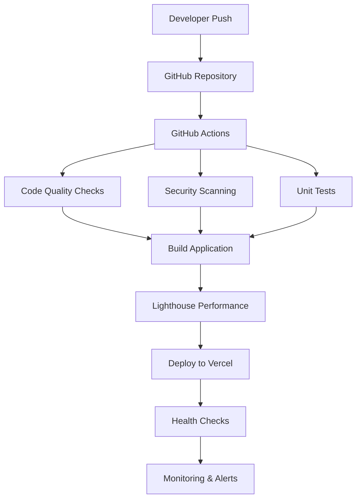

# DevOps Portfolio - Sample Code & Implementation Strategy

## 🎯 Complete Tech Stack Justification

### Frontend Framework: Next.js 14

**Why Next.js:**

- ✅ Server-side rendering for SEO optimization
- ✅ App Router for modern React patterns
- ✅ Built-in image optimization
- ✅ API routes for serverless functions
- ✅ Automatic code splitting and performance optimization
- ✅ Vercel deployment integration

### Styling: Tailwind CSS

**Why Tailwind:**

- ✅ Utility-first approach for rapid development
- ✅ Built-in dark mode support
- ✅ Responsive design utilities
- ✅ Consistent design system
- ✅ Tree-shaking for optimal bundle size

### Animation: Framer Motion

**Why Framer Motion:**

- ✅ Declarative animations
- ✅ Gesture support
- ✅ Layout animations
- ✅ Performance optimized
- ✅ React-first approach

## 📦 Essential npm Packages

```json
{
  "dependencies": {
    "next": "^14.0.0",
    "react": "^18.0.0",
    "react-dom": "^18.0.0",
    "typescript": "^5.0.0",
    "tailwindcss": "^3.0.0",
    "framer-motion": "^10.0.0",
    "lucide-react": "^0.300.0",
    "@next/mdx": "^14.0.0",
    "@mdx-js/loader": "^3.0.0",
    "@mdx-js/react": "^3.0.0",
    "simple-icons": "^10.0.0",
    "react-hot-toast": "^2.4.0",
    "@sentry/nextjs": "^7.0.0",
    "@vercel/analytics": "^1.0.0",
    "next-themes": "^0.2.0"
  },
  "devDependencies": {
    "@types/node": "^20.0.0",
    "@types/react": "^18.0.0",
    "@types/react-dom": "^18.0.0",
    "@types/mdx": "^2.0.0",
    "@tailwindcss/typography": "^0.5.0",
    "eslint": "^8.0.0",
    "eslint-config-next": "^14.0.0",
    "prettier": "^3.0.0"
  }
}
```

## 🔧 Key Component Examples

### 1. Project Card Component

```tsx
interface Project {
  title: string;
  description: string;
  problem: string;
  solution: string;
  impact: string;
  tech: string[];
  liveUrl?: string;
  githubUrl: string;
  featured: boolean;
}

function ProjectCard({ project }: { project: Project }) {
  return (
    <motion.div
      initial={{ opacity: 0, y: 20 }}
      whileInView={{ opacity: 1, y: 0 }}
      className="bg-card border border-border rounded-lg p-6"
    >
      <div className="space-y-4">
        {project.featured && (
          <span className="inline-flex items-center px-3 py-1 rounded-full text-xs font-medium bg-primary/10 text-primary">
            Featured Project
          </span>
        )}

        <h3 className="text-xl font-bold">{project.title}</h3>
        <p className="text-muted-foreground">{project.description}</p>

        {/* Problem-Solution-Impact Grid */}
        <div className="grid grid-cols-1 md:grid-cols-3 gap-4">
          <div className="bg-red-500/10 border border-red-500/20 rounded-lg p-4">
            <h4 className="text-sm font-semibold text-red-600 mb-2">Problem</h4>
            <p className="text-xs text-muted-foreground">{project.problem}</p>
          </div>
          <div className="bg-blue-500/10 border border-blue-500/20 rounded-lg p-4">
            <h4 className="text-sm font-semibold text-blue-600 mb-2">
              Solution
            </h4>
            <p className="text-xs text-muted-foreground">{project.solution}</p>
          </div>
          <div className="bg-green-500/10 border border-green-500/20 rounded-lg p-4">
            <h4 className="text-sm font-semibold text-green-600 mb-2">
              Impact
            </h4>
            <p className="text-xs text-muted-foreground">{project.impact}</p>
          </div>
        </div>

        {/* Tech Stack */}
        <div className="flex flex-wrap gap-2">
          {project.tech.map((tech) => (
            <span
              key={tech}
              className="px-3 py-1 bg-muted rounded-full text-xs"
            >
              {tech}
            </span>
          ))}
        </div>

        {/* Actions */}
        <div className="flex space-x-4">
          <a
            href={project.githubUrl}
            className="flex items-center space-x-2 text-muted-foreground hover:text-foreground"
          >
            <Github className="w-4 h-4" />
            <span>View Code</span>
          </a>
          {project.liveUrl && (
            <a
              href={project.liveUrl}
              className="flex items-center space-x-2 text-primary"
            >
              <ExternalLink className="w-4 h-4" />
              <span>Live Demo</span>
            </a>
          )}
        </div>
      </div>
    </motion.div>
  );
}
```

### 2. GitHub Actions CI/CD Pipeline

```yaml
name: DevOps Portfolio CI/CD

on:
  push:
    branches: [main, develop]
  pull_request:
    branches: [main]

jobs:
  quality-check:
    runs-on: ubuntu-latest
    steps:
      - uses: actions/checkout@v4
      - uses: actions/setup-node@v4
        with:
          node-version: "18"
          cache: "npm"

      - run: npm ci
      - run: npm run lint
      - run: npm run type-check
      - run: npm audit --audit-level=moderate

  test:
    needs: quality-check
    runs-on: ubuntu-latest
    steps:
      - uses: actions/checkout@v4
      - uses: actions/setup-node@v4
        with:
          node-version: "18"
          cache: "npm"

      - run: npm ci
      - run: npm run test:ci

      - uses: codecov/codecov-action@v3
        with:
          token: ${{ secrets.CODECOV_TOKEN }}

  security-scan:
    needs: quality-check
    runs-on: ubuntu-latest
    steps:
      - uses: actions/checkout@v4

      - uses: aquasecurity/trivy-action@master
        with:
          scan-type: "fs"
          format: "sarif"
          output: "trivy-results.sarif"

      - uses: github/codeql-action/upload-sarif@v3
        with:
          sarif_file: "trivy-results.sarif"

  deploy-production:
    if: github.ref == 'refs/heads/main'
    needs: [test, security-scan]
    runs-on: ubuntu-latest
    environment: production
    steps:
      - uses: actions/checkout@v4
      - uses: actions/setup-node@v4
        with:
          node-version: "18"
          cache: "npm"

      - run: npm install -g vercel@latest
      - run: vercel pull --yes --environment=production --token=${{ secrets.VERCEL_TOKEN }}
      - run: vercel build --prod --token=${{ secrets.VERCEL_TOKEN }}
      - run: vercel deploy --prebuilt --prod --token=${{ secrets.VERCEL_TOKEN }}
```

### 3. Contact Form with API Route

```tsx
// Contact Form Component
function ContactForm() {
  const [isSubmitting, setIsSubmitting] = useState(false);

  const handleSubmit = async (e: React.FormEvent<HTMLFormElement>) => {
    e.preventDefault();
    setIsSubmitting(true);

    const formData = new FormData(e.currentTarget);
    const data = {
      name: formData.get("name"),
      email: formData.get("email"),
      subject: formData.get("subject"),
      message: formData.get("message"),
    };

    try {
      const response = await fetch("/api/contact", {
        method: "POST",
        headers: { "Content-Type": "application/json" },
        body: JSON.stringify(data),
      });

      const result = await response.json();

      if (response.ok) {
        toast.success(result.message);
        e.currentTarget.reset();
      } else {
        toast.error(result.error);
      }
    } catch (error) {
      toast.error("Failed to send message");
    } finally {
      setIsSubmitting(false);
    }
  };

  return (
    <form onSubmit={handleSubmit} className="space-y-6">
      <div>
        <label htmlFor="name" className="block text-sm font-medium mb-2">
          Name
        </label>
        <input
          id="name"
          name="name"
          type="text"
          required
          className="w-full px-3 py-2 border border-border rounded-lg focus:ring-2 focus:ring-primary"
        />
      </div>

      <div>
        <label htmlFor="email" className="block text-sm font-medium mb-2">
          Email
        </label>
        <input
          id="email"
          name="email"
          type="email"
          required
          className="w-full px-3 py-2 border border-border rounded-lg focus:ring-2 focus:ring-primary"
        />
      </div>

      <div>
        <label htmlFor="subject" className="block text-sm font-medium mb-2">
          Subject
        </label>
        <input
          id="subject"
          name="subject"
          type="text"
          required
          className="w-full px-3 py-2 border border-border rounded-lg focus:ring-2 focus:ring-primary"
        />
      </div>

      <div>
        <label htmlFor="message" className="block text-sm font-medium mb-2">
          Message
        </label>
        <textarea
          id="message"
          name="message"
          rows={5}
          required
          className="w-full px-3 py-2 border border-border rounded-lg focus:ring-2 focus:ring-primary"
        />
      </div>

      <button
        type="submit"
        disabled={isSubmitting}
        className="w-full bg-primary text-primary-foreground py-3 rounded-lg font-semibold hover:bg-primary/90 disabled:opacity-50"
      >
        {isSubmitting ? "Sending..." : "Send Message"}
      </button>
    </form>
  );
}
```

## 🏗️ Infrastructure as Code Content Ideas

### 1. Portfolio Architecture Section Content

#### CI/CD Pipeline Visualization



#### Infrastructure Components

- **Frontend**: Next.js on Vercel Edge Network
- **API**: Serverless functions on Vercel
- **CDN**: Vercel's global CDN + optional CloudFront
- **Monitoring**: Sentry for errors, Vercel Analytics for performance
- **CI/CD**: GitHub Actions with automated testing and deployment
- **Security**: Dependency scanning, SAST, secret scanning

#### Performance Metrics Dashboard

- **Build Time**: < 2 minutes
- **Deployment Frequency**: 10+ per day
- **Lead Time for Changes**: < 10 minutes
- **Mean Time to Recovery**: < 5 minutes
- **Change Failure Rate**: < 5%
- **Lighthouse Score**: 95+

### 2. DevOps Best Practices Demonstrated

#### Automation

- ✅ Automated testing in CI/CD
- ✅ Automated security scanning
- ✅ Automated performance testing
- ✅ Automated deployments
- ✅ Automated monitoring and alerting

#### Infrastructure as Code

- ✅ Terraform for AWS resources
- ✅ Vercel configuration as code
- ✅ GitHub Actions workflows
- ✅ Environment configuration
- ✅ Secret management

#### Monitoring & Observability

- ✅ Error tracking with Sentry
- ✅ Performance monitoring
- ✅ Real user monitoring
- ✅ Synthetic monitoring
- ✅ Log aggregation

#### Security

- ✅ Dependency vulnerability scanning
- ✅ Static code analysis
- ✅ Secret scanning
- ✅ Security headers
- ✅ HTTPS everywhere

## 🚀 Step-by-Step Implementation Guide

### Week 1: Foundation

1. **Day 1-2**: Set up Next.js project with TypeScript and Tailwind
2. **Day 3-4**: Create basic layout, navigation, and theme provider
3. **Day 5-7**: Implement hero section and basic styling

### Week 2: Content & Features

1. **Day 1-2**: Build about section with GitHub integration
2. **Day 3-4**: Create projects showcase with project cards
3. **Day 5-6**: Implement skills section with animations
4. **Day 7**: Add contact form with API route

### Week 3: DevOps Integration

1. **Day 1-2**: Set up GitHub Actions CI/CD pipeline
2. **Day 3-4**: Configure Lighthouse performance testing
3. **Day 5-6**: Implement security scanning and monitoring
4. **Day 7**: Create infrastructure as code with Terraform

### Week 4: Optimization & Launch

1. **Day 1-2**: SEO optimization and meta tags
2. **Day 3-4**: Performance optimization and testing
3. **Day 5-6**: Deploy to production and configure monitoring
4. **Day 7**: Documentation and final testing

## 🎯 Portfolio Architecture Content Ideas

### 1. Technical Deep Dive

- **Architecture Decision Records (ADRs)**
- **Performance optimization techniques**
- **Security implementation details**
- **Scalability considerations**
- **Cost optimization strategies**

### 2. DevOps Metrics

- **DORA metrics tracking**
- **SLA/SLO definitions**
- **Error budgets**
- **Performance benchmarks**
- **Resource utilization**

### 3. Lessons Learned

- **Technology choices and trade-offs**
- **Challenges faced and solutions**
- **Performance improvements achieved**
- **Security enhancements implemented**
- **Future roadmap and improvements**

This portfolio serves as both a showcase of your DevOps skills and a practical demonstration of modern web development and infrastructure practices. The architecture itself tells the story of your technical expertise and attention to production-ready systems.
